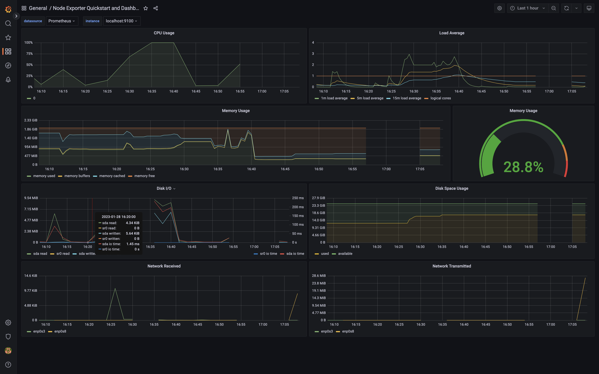

## Part 7. Prometheus и Grafana / Part 8. Готовый дашборд

### Мониторинг серверов на основе Prometheus+Grafana

#### **Описание компонентов (Общая информация из интернета)**

`Prometheus` - центральный сервер, предназначенный для сбора и хранения данных. Данные постоянно изменяются во времени (например, уровень заполненности диска, трафик через сетевой интерфейс, время отклика сайта). Элементы данных называются метриками. Сервер Prometheus с заданной периодичностью считывает метрики и помещает полученные данные в Time Series DB. Time Series DB - это разновидность баз данных, предназначенная для хранения временных рядов (значений с привязкой ко времени). Кроме того, Prometheus предоставляет интерфейс для выполнения запросов и визуализации полученных данных. Язык запросов Prometheus называется PromQL.

`Exporters` - процессы, обеспечивающие сбор и их передачу серверу Prometheus. Существует много разных exporters, например:
    Node_exporter - сбор системных метрик (процессор, память, и т.д.).
    Mysqld_exporter - сбор метрик работы сервера MySQL.
    Postgres_exporter - сбор метрик работы сервера PostgreSQL.

`Grafana` - удобный frontend для визуализации накопленных данных, может использоваться для работы с данными сервера Prometheus, предоставляет различные преднастроенные Dashboard для отображения данных.

#### **Визуализация нагрузок**

